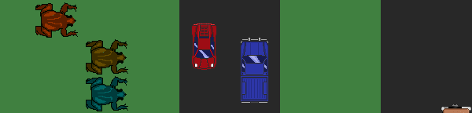

Darting Frogs
=============

A frog race where every frog has just one control key to make it jump forward.
Press *any* key or joypad button to get a frog, and then that's your jump key.

Everyone else who presses a key gets a frog as well, to race yours.

Why "darting"?
--------------

When I was reading about frogs, Wikipedia had articles about poison dart frogs,
which have bright colors to warn off predators.  The word "darting" can also
mean hurrying from place to place.

Inspirations
------------

The inspiration for this was the similar multiplayer game Pixfrogger, and of
course the many versions of Frogger itself.  Pixfrogger is based on a 32-bit
game engine, and it seemed better to rewrite it from scratch instead of trying
to port the engine.

The idea of "press any key, get a frog" for combining the key selection and
number of players amused me, so I decided to implement it.

Development notes
=================

Frog images and team colors
---------------------------

The game only has one set of frog images, with magenta coloration. This is
using the "magenta is the team color" idea that's documented on
[Wesnoth's Wiki](https://wiki.wesnoth.org/Team_Color_Shifting)

License
=======

The code is GPLv2+, partly based on Tom Chance's PyGame tutorial.

The placeholder frog image is copyright Octalot and licensed under CC-BY 3.0.

* data/frog\_resting.png
* data/frog\_resting.xcf

The garbage truck image is copyright Satik64, and licensed under CC0. It was
downloaded from
https://opengameart.org/content/garbage-truck

* data/trashmaster.png

Several car and truck images are copyright Lowder2 (Antony Christian Sumakud),
and licensed under CC-BY 3.0. They were downloaded from
https://opengameart.org/content/vary-car-pack-1

* data/cars/BuickerB.png
* data/cars/GalardB.png
* data/cars/JeepB.png
* data/cars/RamB.png
* data/cars/SuperB.png

The road textures are cropped from supertuxkart's `city_asphalt` texture, which
is copyright Thomas Oppl (horace), and licensed under CC-BY-SA 3.0. They've also
been reduced to 16 colors to compress them.

* data/terrain/road1.png
* data/terrain/road2.png

The grass terrain is from Widelands, and is GPL-2+.

* `data/terrain/meadow1_00.png`
* `data/terrain/meadow2_00.png`
* `data/terrain/meadow3_00.png`
* `data/terrain/meadow4_00.png`
